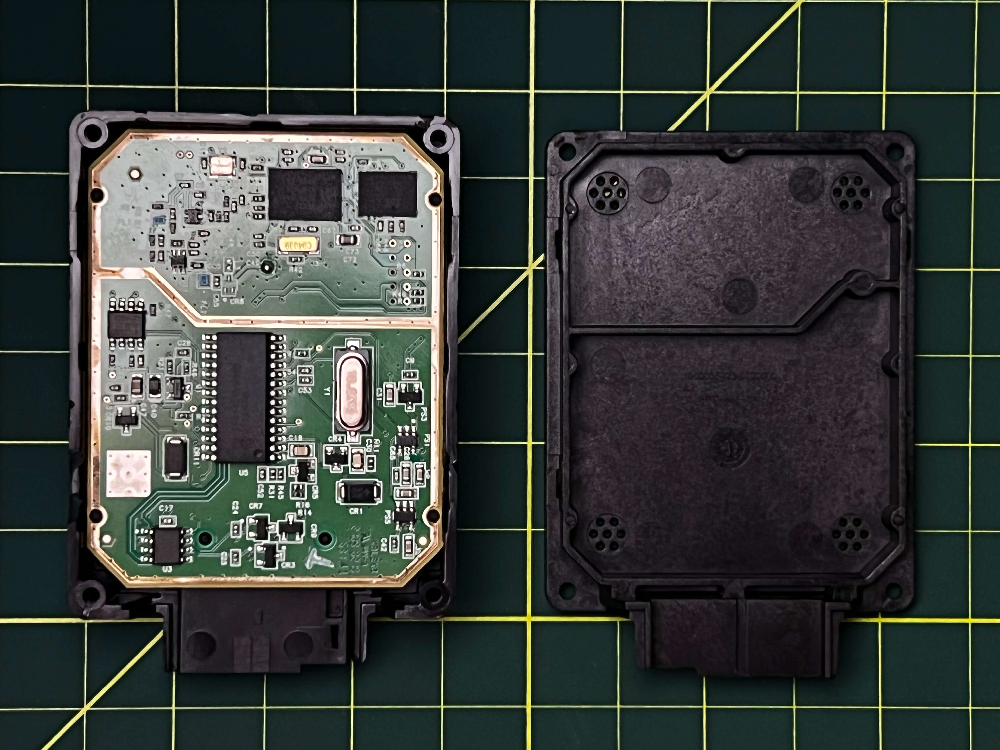
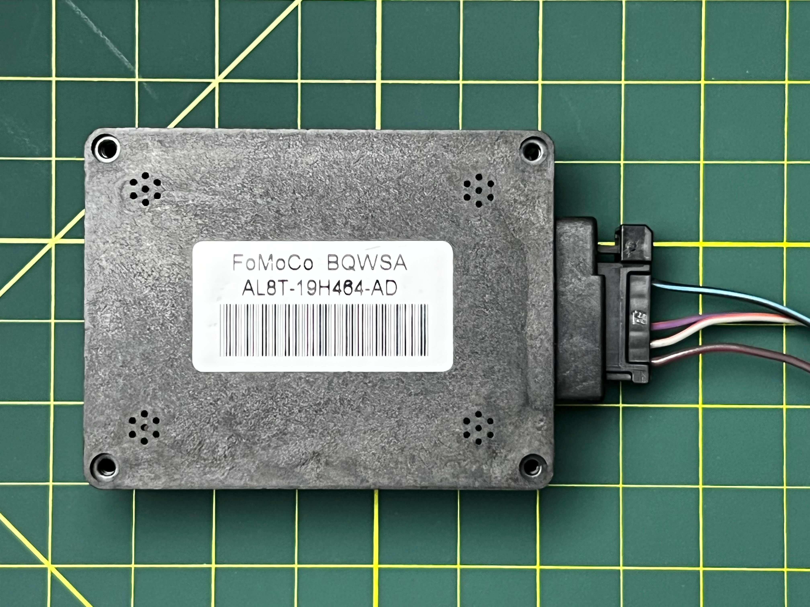

# Ford-GPS-Module
Interfacing with commonly found GPS module via CAN BUS inside Ford vehicles. 

<br>

# Background
Many newer ( 2010+ ) Ford models come equipped with a GPS Module, this is often the case regardless of trim level or additional upgrades ( navigation units ). Through the CANBUS of the vehicle, you can read the GPS data from this module and use it for various applications, such as tracking; or use the module standalone and integrate into another project. It is great because it comes as an all in one package: Enclosure, GPS SOC, GPS Antenna, Power Regulation, etc... 

<br>

# Hardware
You can find the standalone module second-hand for quite cheap on markets like eBay, or they can be pulled from scrap vehicles in wrecking yards. The GPS module is under the dashboard on the passenger side ( behind the airbag ) Make sure to also cut the wiring harness to save yourself the effort of needing to build your own cable/connector.

Common markings I've seen for this module are:
<br>
**MAANAT0256**
<br>
**BQWSG**
<br>
**BQWSA**

<br>

# Teardown



See more images in the [docs](docs/) folder.

<br>

# Pinout
```
#   CABLE COLOR     PIN

1   RED/GREY        VBAT
2   ORANGE/GREY     CANH
3   ORANGE/PURPLE   CANL
4   N/A             NC
5   N/A             NC
6   BLACK/BLUE      GND
             
```

# Interface / Operation

The module is interconnected to the rest of the vehicle using CANBUS over the MS-CAN ( Medium Speed ) interface at a speed of 125kbps.

The module will automatically go to sleep if there is no CAN activity, so a periodic ( 1 sec ) ping or message will keep the module awake. 

You can power the module with power source ranging from ( ~5-16V ).

<br>

# Example
Using your microcontroller of choice ( Arduino, ESP32, etc...) and a CAN Transciever it is very easy to read the GPS Data that is sent over CAN Messages. <br>

Here is an example of reading the GPS data from the CAN Messages:

```

```
<br>

# TODO

- implement the function to unpack/decode the CAN Frame as described in the OpenDBC table. 

<br>

# References
Decoding Ford CANBUS: 
https://github.com/commaai/opendbc/blob/master/ford_cgea1_2_ptcan_2011.dbc#L1446
<br>